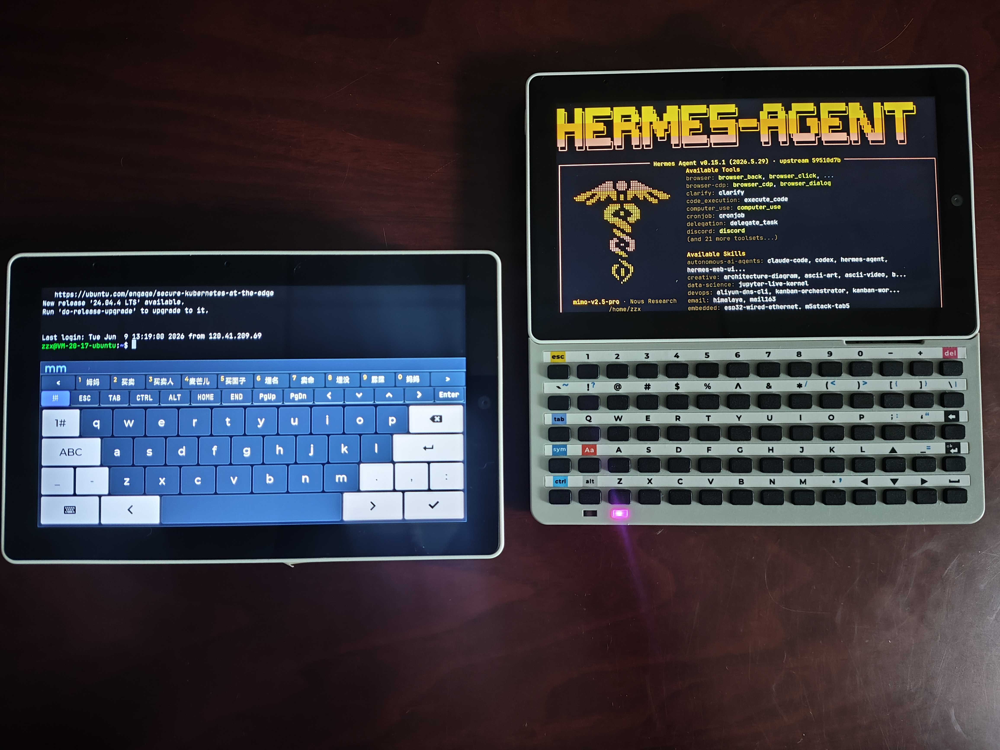
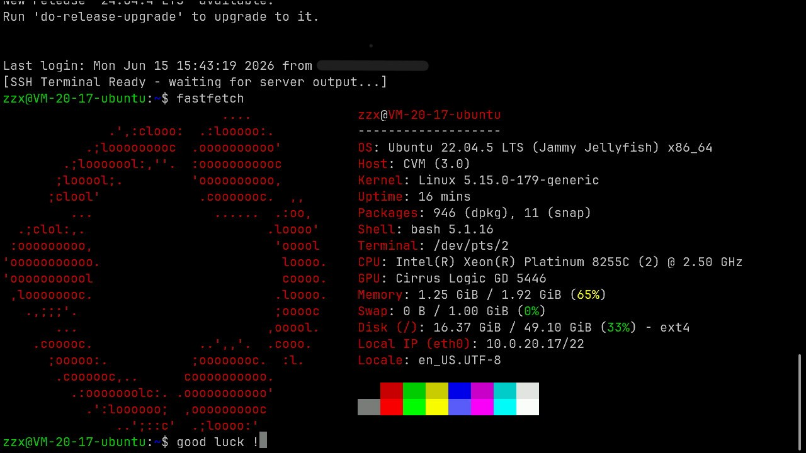
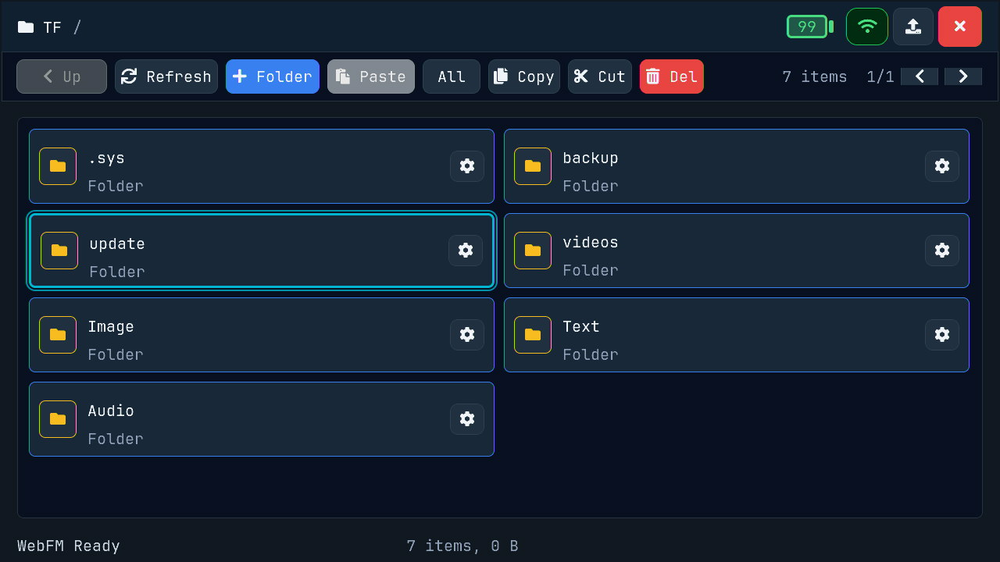
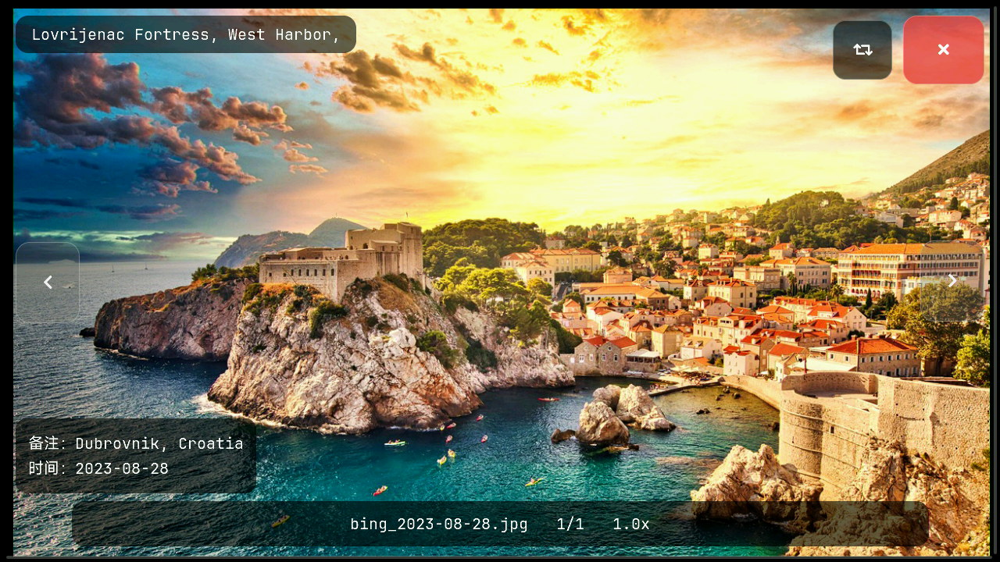
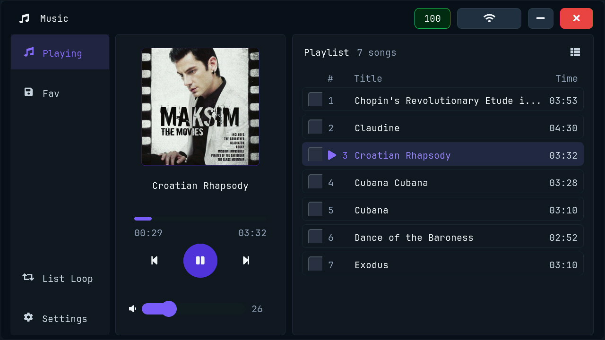
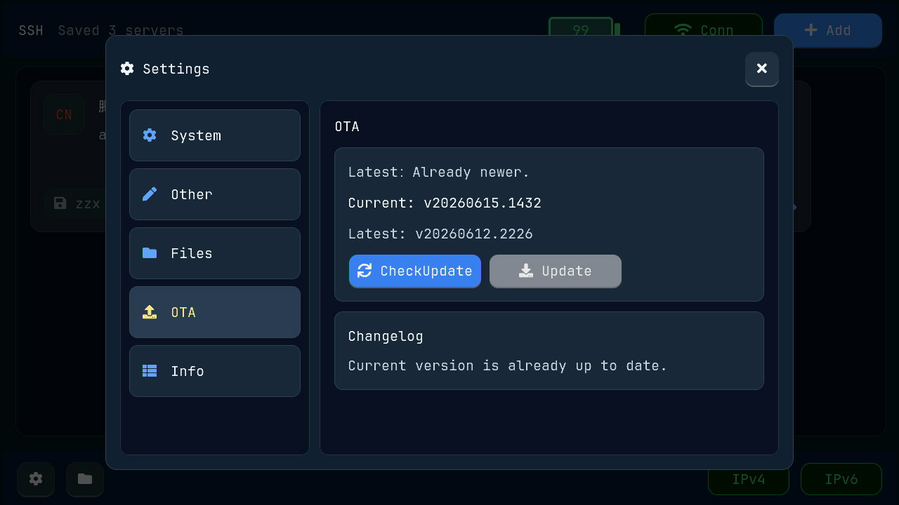
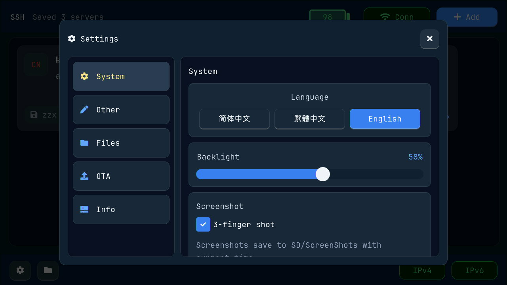
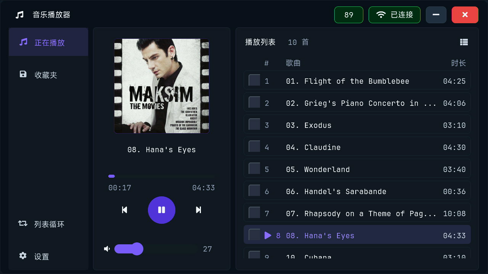

# M5Stack Tab5 AIO Box

**English** | [简体中文](README_zh-CN.md) | [繁體中文](README_zh-TW.md)

> A portable SSH terminal, file manager, media viewer, and OTA maintenance tool for the ESP32-P4 + M5Stack Tab5 hardware platform.

## Quick Start

Start here if you only want to use the device:

**[English Quick Start Guide](QUICK_START_GUIDE.md)**  
[简体中文快速使用手册](QUICK_START_GUIDE_zh-CN.md) | [繁體中文快速使用手冊](QUICK_START_GUIDE_zh-TW.md)

Different language versions have their own guide. The English guide focuses on general SSH, WiFi, file management, OTA, and maintenance workflows.

---

## System Language

On first boot, the device asks you to choose a system language. You can change it later from **Settings > System**.

Currently supported:

- English
- 简体中文
- 繁體中文


---

## Notes

1. Enabling WiFi to upload files via the online file manager consumes significant power (nearly 11W). After flashing firmware via USB, please use a power adapter capable of delivering 5V 2A.
2. Due to a known architectural flaw in the ESP32-P4 + C6 design (SDIO flow control defect for inbound TCP data / upload direction), uploading multiple large files via the online file manager is highly unstable. We are waiting for a new solution from the community.

## Product Preview



The device can be used with the Tab5 touchscreen, an optional physical keyboard, TF card storage, WiFi networking, and the built-in SSH terminal UI.

---

## Key Features

### SSH Terminal Client

- Save multiple SSH servers and connect by tapping a server card
- Edit or delete saved servers from the card action menu
- IPv4/IPv6 network status display
- Full-screen terminal with touch hot zones for the status bar, control bar, and soft keyboard
- Optional physical keyboard support for common terminal keys



### TF Card File Manager

- Browse, copy, cut, paste, rename, and delete files on the TF card
- Batch actions, including select all, copy, cut, and delete
- Image viewing, text file viewing, EXIF metadata display, and MP3/FLAC music playback
- Online file manager over WiFi for browser-based file access




### Music Player

- Play MP3/FLAC files from the TF card
- Background playback bar
- Favorites list
- Album cover display when embedded artwork is available



### OTA Firmware Upgrade

- Check main firmware and UPLOAD firmware updates from Settings
- Download firmware packages to the TF card
- Verify version and package data before installation



### Flashing And Launcher Support

- `flash_at_0x0/tab5_full_flash.bin` is the full merged image and should be flashed from address `0x0`.
- `Partition_images/` contains the individual partition images and detailed esptool commands.
- The current partition layout is compatible with [bmorcelli/Launcher](https://github.com/bmorcelli/Launcher): `main_app` is the first app partition at `0x20000`, so Launcher-style full-flash extraction selects the SSH client app.
- When booted by Launcher, the firmware page can check update information, but direct in-app OTA installation is disabled. Please update through Launcher in that mode.

### System Tools

- WiFi manager with saved network list
- Battery, USB-C, and charging status display
- Three-finger screenshot saved to `/ScreenShots` on the TF card
- Encrypted and plain configuration backup options
- Supports configurable standby screensaver; long-press to move widgets while active.




---
---

## Hardware Platform

- **Chip**: ESP32-P4
- **Device**: M5Stack Tab5
- **Storage**: 16 MB Flash + 32 MB PSRAM
- **Interfaces**: TF card, USB-C, optional physical keyboard
- **Display**: 720 x 1280 MIPI DSI touchscreen

---

## Repository Layout

```text
├── flash_at_0x0/              # Full merged firmware image, flash from address 0x0
├── Partition_images/          # Individual partition images and flashing guide
├── images/                    # Product photos and screenshots
├── test_images_with_EXIF/     # Sample images with EXIF metadata
├── QUICK_START_GUIDE.md       # English quick start guide
├── QUICK_START_GUIDE_zh-CN.md # Simplified Chinese quick start guide
├── QUICK_START_GUIDE_zh-TW.md # Traditional Chinese quick start guide
├── README.md                  # Default English project page
├── README_en.md               # English project page mirror
├── README_zh-CN.md            # Simplified Chinese project page
└── README_zh-TW.md            # Traditional Chinese project page
```

---

## Privacy Notice

SSH server credentials are stored with AES-256-GCM encryption. Configuration backups can be exported as encrypted backups or plain backups depending on the migration scenario.

Except for necessary OTA requests, the firmware does not send private SSH, WiFi, or file data to external services.

## License

This project uses the libssh library under LGPL v2.1.
