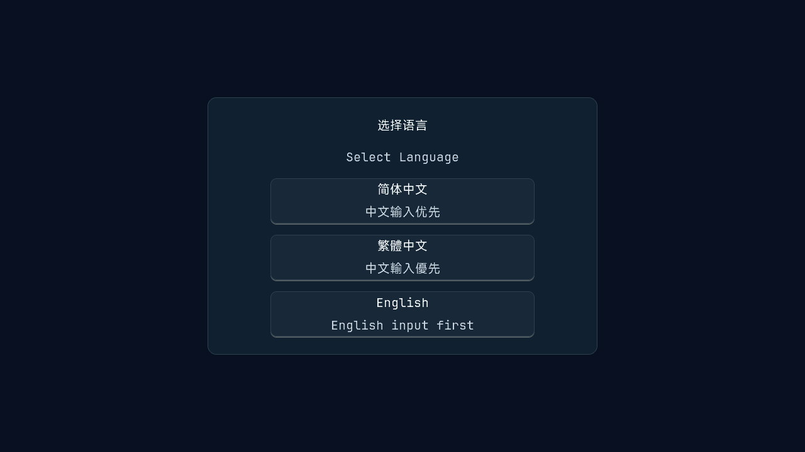
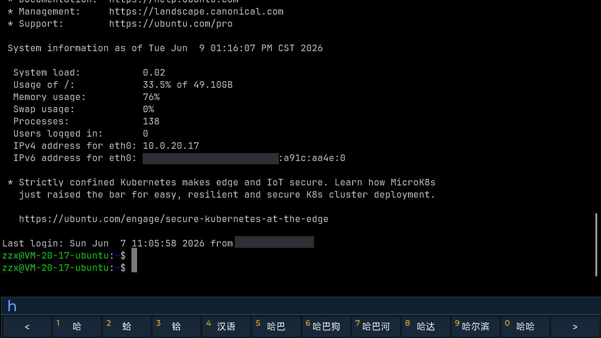
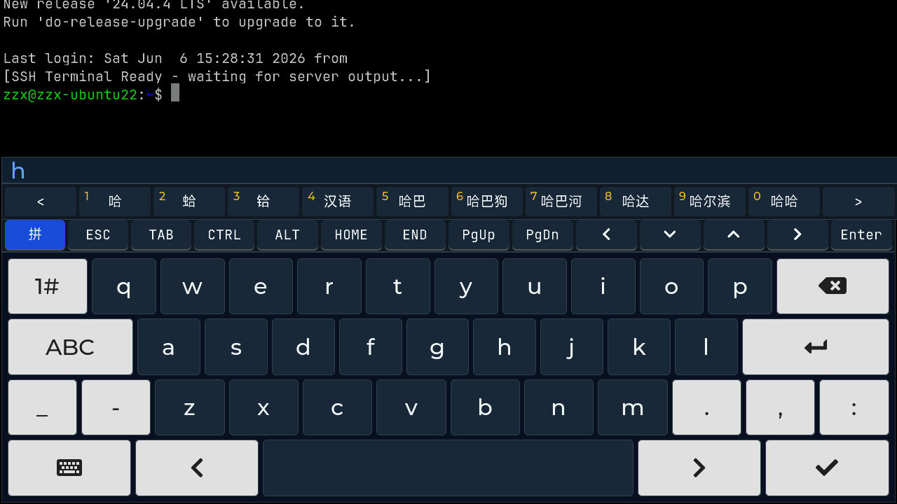
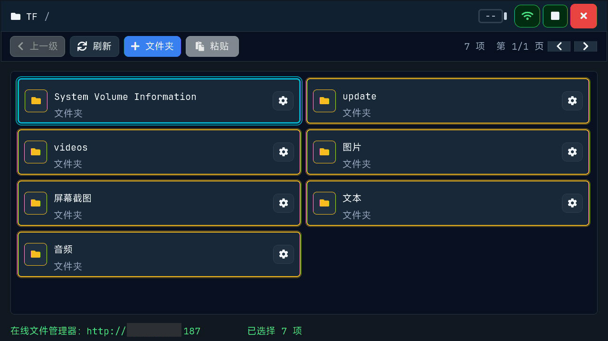
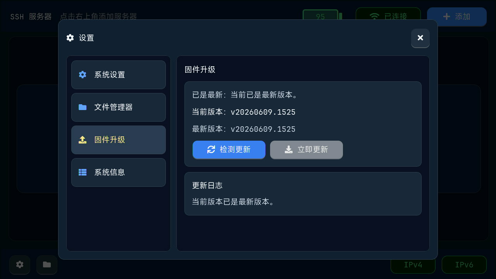
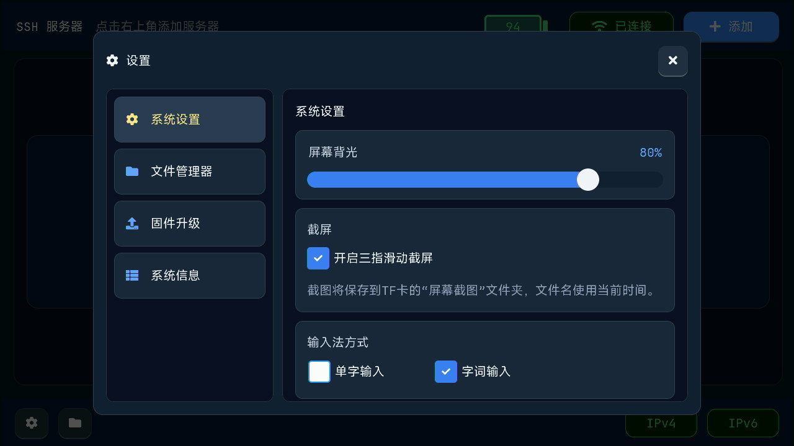

# M5Stack Tab5 AIO Box

[English](README.md) | [简体中文](README_zh-CN.md) | **繁體中文**

> 基於 ESP32-P4 + M5Stack Tab5 硬體平台的便攜式 SSH 終端、檔案管理器、媒體檢視器和 OTA 維護工具。

## 快速使用

如果只想快速上手，請從這裡開始：

**[繁體中文快速使用手冊](QUICK_START_GUIDE_zh-TW.md)**  
[English Quick Start Guide](QUICK_START_GUIDE.md) | [简体中文快速使用手册](QUICK_START_GUIDE_zh-CN.md)

不同語言版本對應不同快速手冊。繁體中文手冊會包含中文拼音輸入法、實體鍵盤和軟鍵盤的詳細操作說明。

---

## 系統語言

首次進入系統時可以選擇系統語言，後續可以在 **系統設定 > 系統** 中隨時更改。

目前支援：

- English
- 简体中文
- 繁體中文



---

## 產品預覽


設備可配合 Tab5 觸控螢幕、可選實體鍵盤、TF 卡儲存、WiFi 網路和內建 SSH 終端介面使用。

---

## 核心亮點

### SSH 終端客戶端

- 支援保存多個 SSH 伺服器，短按伺服器卡片快速連接
- 長按伺服器卡片可編輯或刪除
- 支援 IPv4/IPv6 網路狀態顯示
- 全螢幕終端顯示，觸控熱區呼出狀態列、控制列和軟鍵盤
- 支援可選實體鍵盤，覆蓋常用終端按鍵



### 中文輸入與鍵盤

- 中文系統預設支援拼音輸入
- 拼音模式可透過觸控候選字或數字鍵選字
- 英文模式直接發送字符到遠端終端
- 實體鍵盤自動適配，偵測到鍵盤後可隱藏軟鍵盤



### TF 卡檔案管理器

- 本地瀏覽、複製、剪切、貼上、重新命名、刪除 TF 卡檔案
- 支援全選、複製、剪切、刪除等批量操作
- 支援圖像查看、文字查看、EXIF 資訊顯示、MP3/FLAC 音樂播放
- WiFi 環境下可開啟線上檔案管理器，透過瀏覽器存取設備檔案



### 音樂播放器

- 從 TF 卡播放 MP3/FLAC 音樂
- 支援後台音樂條
- 支援收藏夾
- 支援讀取歌曲內嵌封面並顯示


### OTA 韌體升級

- 在設定頁偵測主程式和 UPLOAD 韌體更新
- 下載韌體包到 TF 卡
- 安裝前進行版本和檔案校驗



### 系統工具

- WiFi 管理和已保存網路列表
- 電池、USB-C、充電狀態顯示
- 三指滑動截圖，保存到 TF 卡 `/ScreenShots`
- 支援加密備份和非加密備份
- 支援語言、時區、頂部後台音樂條、顯示等設定



---

## 硬體平台

- **晶片**：ESP32-P4
- **設備**：M5Stack Tab5
- **儲存**：16 MB Flash + 32 MB PSRAM
- **介面**：TF 卡、USB-C、可選實體鍵盤
- **螢幕**：720 x 1280 MIPI DSI 觸控螢幕

---

## 目錄結構

```text
├── flash-at-0x0/              # 完整韌體，使用 esptool 從 0x0 位址刷入
├── images/                    # 產品截圖
├── exif-test-images/          # 含 EXIF 資訊的測試圖片
├── QUICK_START_GUIDE.md       # 英文快速使用手冊
├── QUICK_START_GUIDE_zh-CN.md # 简体中文快速使用手册
├── QUICK_START_GUIDE_zh-TW.md # 繁體中文快速使用手冊
├── README.md                  # GitHub 預設英文專案說明
├── README_en.md               # 英文專案說明鏡像
├── README_zh-CN.md            # 简体中文项目说明
└── README_zh-TW.md            # 繁體中文專案說明
```

---

## 隱私說明

SSH 伺服器憑據使用 AES-256-GCM 加密儲存。設定備份可根據遷移場景選擇加密備份或非加密備份。

除 OTA 所需的必要請求外，韌體不會向外部服務發送 SSH、WiFi 或檔案隱私資料。

## 授權

本專案使用 libssh 庫（LGPL v2.1）。
